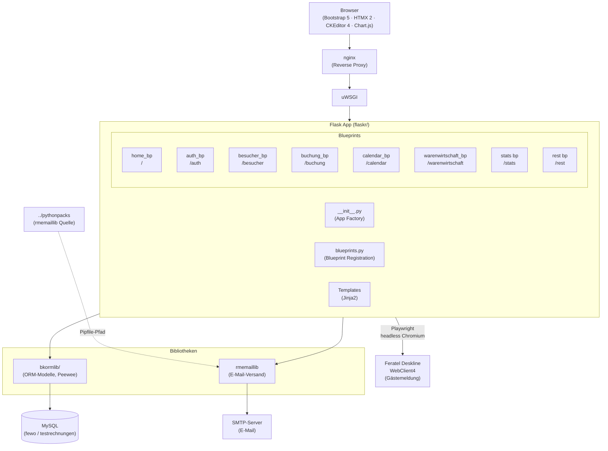
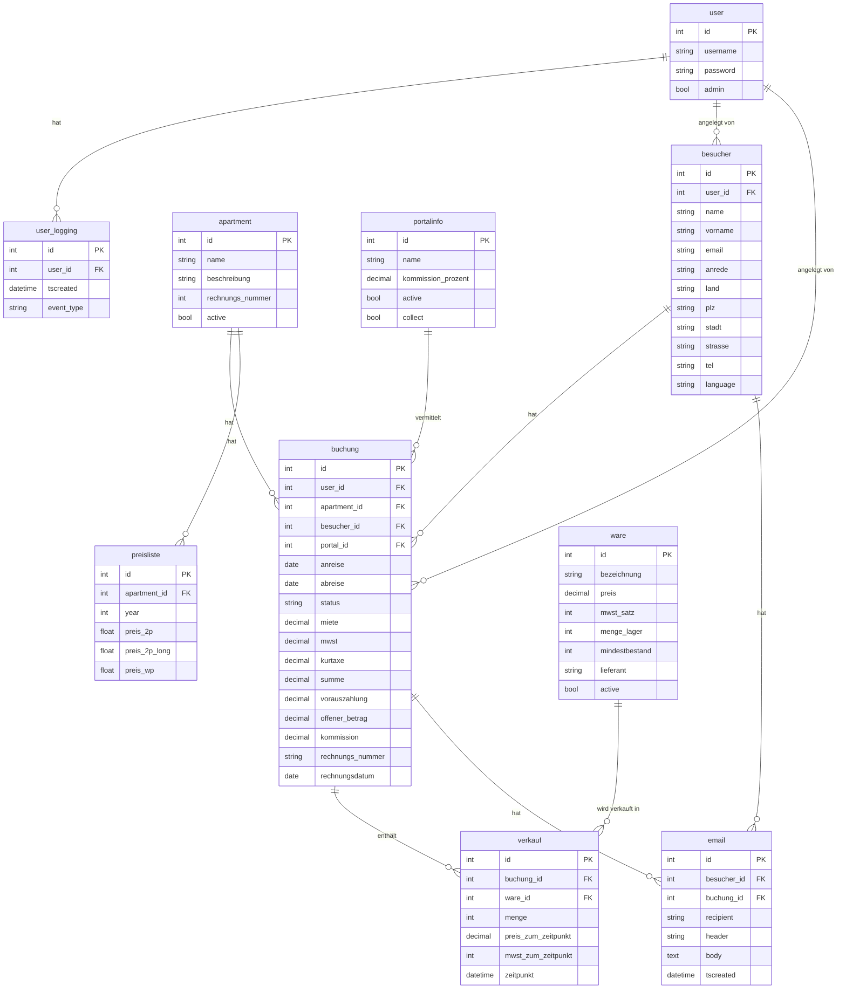

# Architektur — fewo-calserver

## App-Architektur



---

## Datenbankschema



---

## Blueprint-Übersicht

| Blueprint | URL-Prefix | Funktion |
|---|---|---|
| `home_bp` | `/` | Startseite, Dashboard |
| `auth_bp` | `/auth` | Login, Logout, Passwort ändern |
| `besucher_bp` | `/besucher` | Gäste-Stammdaten |
| `buchung_bp` | `/buchung` | Buchungen, Rechnungen, Angebote |
| `calendar_bp` | `/calendar` | Kalenderansicht |
| `warenwirtschaft_bp` | `/warenwirtschaft` | Artikelstamm, Lieferungen, Statistik |
| `stats bp` | `/stats` | Umsatzauswertungen |
| `rest bp` | `/rest` | JSON-REST-Endpunkte |
| `feratel_bp` | `/feratel` | Playwright-Automation Gästemeldung |
| `json_routes bp` | `/json` | iCal / externe Feeds |
| `info_bp` | `/info` | System-Info |

---

## Verzeichnisstruktur

```
fewo-calserver/
├── bkormlib/               ORM-Modelle (Peewee), Tests
│   ├── schema.py           Alle Datenbankmodelle
│   ├── __init__.py         Exports
│   └── tests/              pytest gegen SQLite in-memory
├── flaskr/                 Flask-App
│   ├── __init__.py         App Factory
│   ├── blueprints.py       Blueprint-Registrierung
│   ├── auth/               Authentifizierung
│   ├── besucher/           Gäste-Verwaltung
│   ├── buchung/            Buchungs-Verwaltung
│   ├── calendar/           Kalender
│   ├── warenwirtschaft/    Warenwirtschaft
│   ├── feratel/            Feratel Gästemeldung (Playwright-Automation)
│   ├── home/               Startseite
│   ├── static/             CSS, JS (Bootstrap via npm)
│   ├── templates/          Globale Templates (layout, nav, rechnung)
│   └── utils/              Hilfsfunktionen, Fehlerseiten
├── tests/                  App-Tests (Flask Test Client)
├── config.py               Konfigurationsklassen (dev/prod)
├── wsgi.py                 WSGI Entry Point
├── flaskr.ini              uWSGI-Konfiguration
├── Pipfile                 Python-Abhängigkeiten
└── .env                    Secrets (nicht im Repo)
```

---

## Frontend-Architektur

Die App verwendet ein **HTMX-basiertes Partial-Rendering-Modell**:
Jede Benutzeraktion lädt nur den betroffenen HTML-Ausschnitt neu,
kein vollständiger Seitenwechsel.

| Technologie | Version | Zweck |
|---|---|---|
| HTMX | 2.0.4 | Deklarative AJAX-Requests, Partial-Rendering |
| Bootstrap | 5.1.0 | CSS-Framework, Grid, Komponenten |
| CKEditor 4 | 4.16.2 | WYSIWYG-Editor für E-Mail-Texte |
| Chart.js | 3.5.1 | Diagramme (Statistik) |
| jQuery | 3.6.0 | Hilfsbibliothek (Bootstrap-Datepicker) |

**HTMX-Muster in dieser App:**

- `hx-get` / `hx-post` auf Buttons und Formulare
- `hx-target` + `hx-swap="innerHTML"` für Partial-Updates
- `hx-vals` für zusätzliche Parameter (z. B. `typ`, `hx_target`)
- `hx-on::before-request` zum Synchronisieren des CKEditor-Inhalts
  vor dem Formular-Submit
- CSRF-Token wird global per `htmx:configRequest`-Event als
  `X-CSRFToken`-Header hinzugefügt (Layout-Template)
- `HX-Redirect`-Response-Header für Navigation nach erfolgreicher Aktion

**Zweistufiger Buchungsflow:**

```
neu_formular (GET) ──► neu_vorschau (POST) ──► neu_email_partial.html
                            │                        │
                    Validierung +               CKEditor + Summary
                    recalc() (unsaved)               │
                                              neu_speichern (POST)
                                                     │
                                              buchung.save()
                                              send_*_emails()
                                              HX-Redirect
```

Gilt analog für `schnell_vorschau` → `neu_speichern` (Schnellbuchung)
und `convert_angebot` (Angebot umwandeln).
